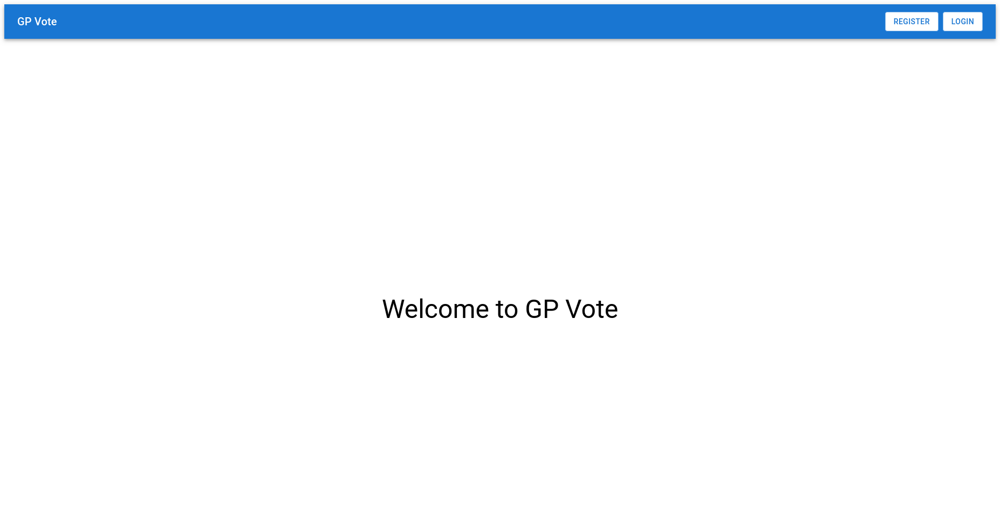
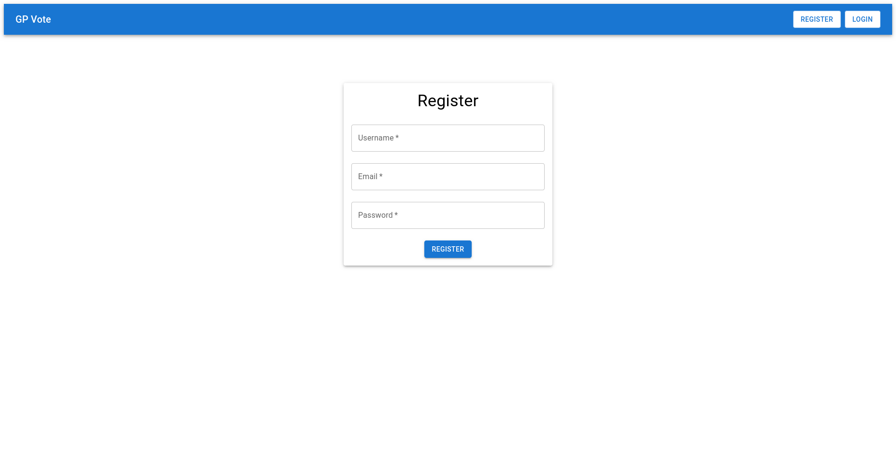
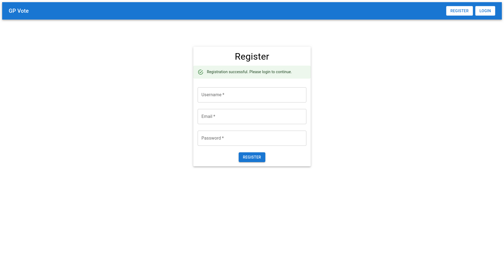
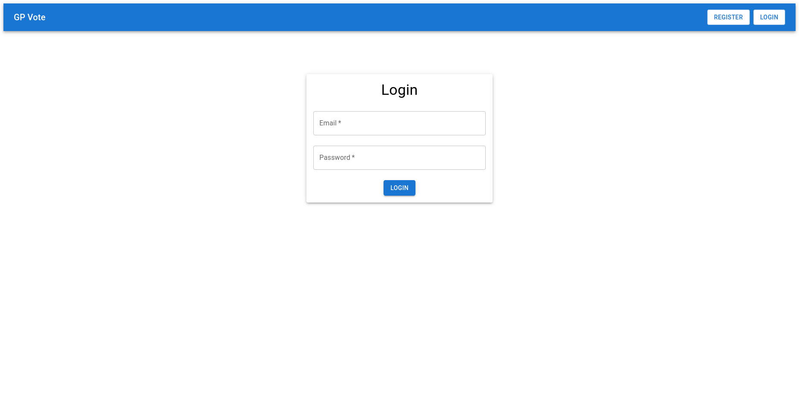
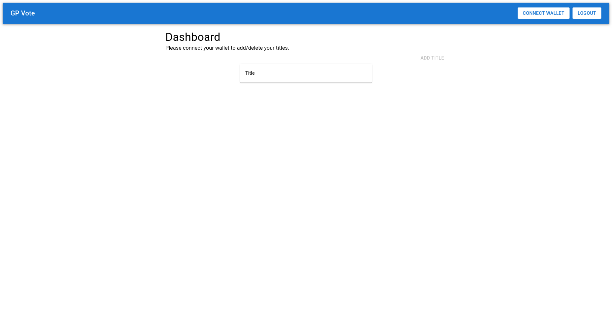
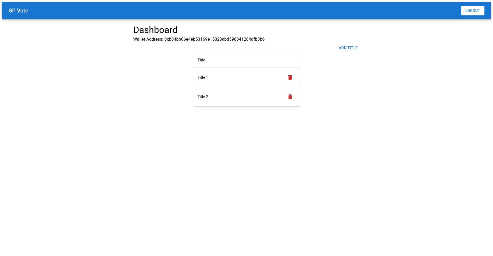
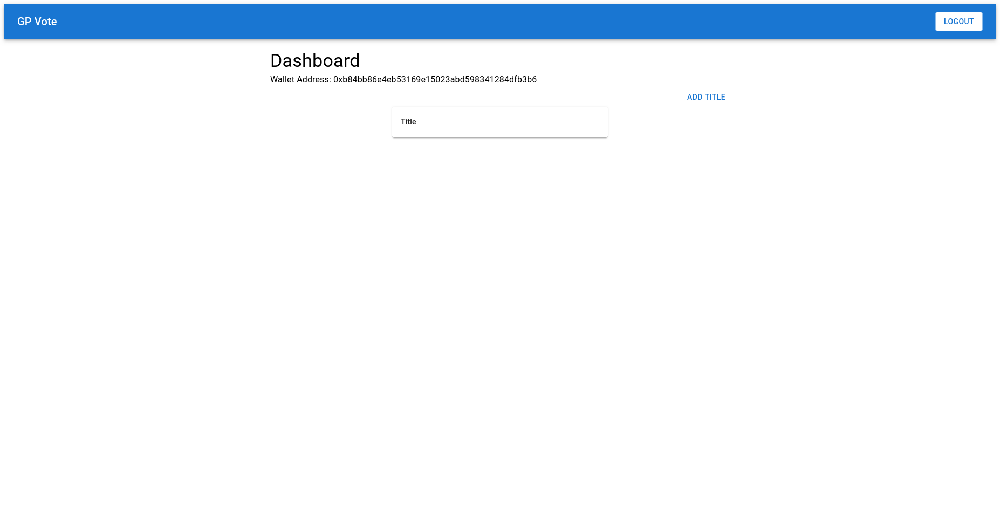
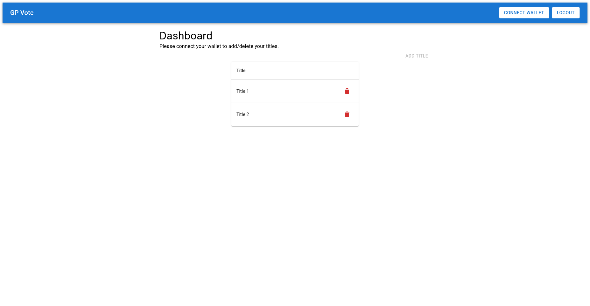
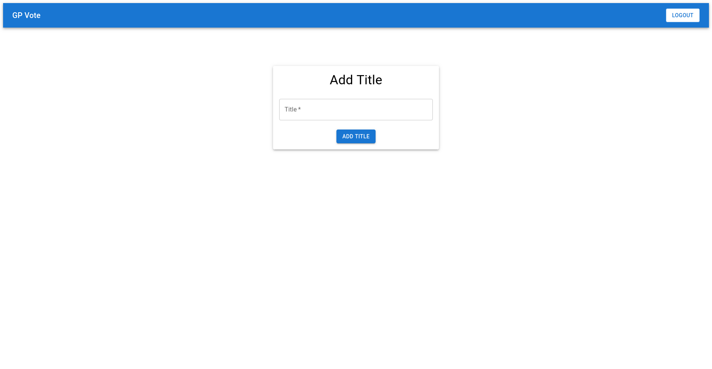

# GP Vote Frontend

## Introduction
This is a simple web application built with React.js and Vite. It allows users to register and log in, manage titles, and connect their wallets to enable certain features. The dashboard provides a view of all titles, regardless of wallet connection status.

## Features
- User registration and login functionality.
- Users can add and delete titles if their wallet is connected.
- A dashboard that lists all titles irrespective of wallet connection status.

## Getting Started

### Prerequisites

- Node.js(LTS) and npm installed
- MetaMask plugin installed

### Installation

1. Clone the repository
```bash
git clone https://github.com/knav33n/gp-vote-fe
```

2. Navigate to the project directory
```bash
cd gp-vote-fe
```

3. Install dependencies
```bash
npm install
```

4. Copy the .env-sample file to .env and modify the value to match the base URL of your backend

5. Start the development server
```bash
npm run dev
```

6. Open http://localhost:5173 in your browser to view the application

## Running Tests

1. Run the tests
```bash
npm run test
```

2. View the test coverage report
```bash
npm run test-coverage
```

## Usage

### Register and Login
- Users can register by providing their email and password.
- After registration, users can log in with their credentials.
- Passwords are securely hashed for storage.

### Adding and Deleting Titles
- Users can add titles after logging in and connecting their wallet.
- If the wallet is not connected, a message prompts the user to connect their wallet to manage titles.
- Users can delete titles by clicking the delete button next to each title.

### Dashboard
- The dashboard displays a list of all titles associated with the user.
- Titles are visible regardless of whether the user's wallet is connected or not.

## Screenshots

*Home Page*


*Registration Page*


*Successful Registration*


*Login Page*


*Dashboard*


*Dashboard with Titles*


*Dashboard with Wallet*


*Dashboard with Titles and No Wallet*


*Add Title Page*

## Technologies Used
- React.js: For building the user interface.
- Vite: For a fast development environment and optimized build.
- Material-UI: For design and UI components.
- Redux Toolkit: For state management.
- Vitest: For unit testing.
- React Testing Library: For testing React components.
- MSW (Mock Service Worker): For mocking API requests during testing.
